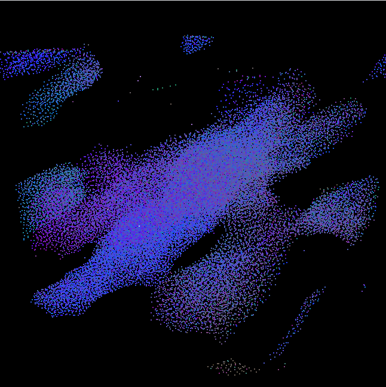
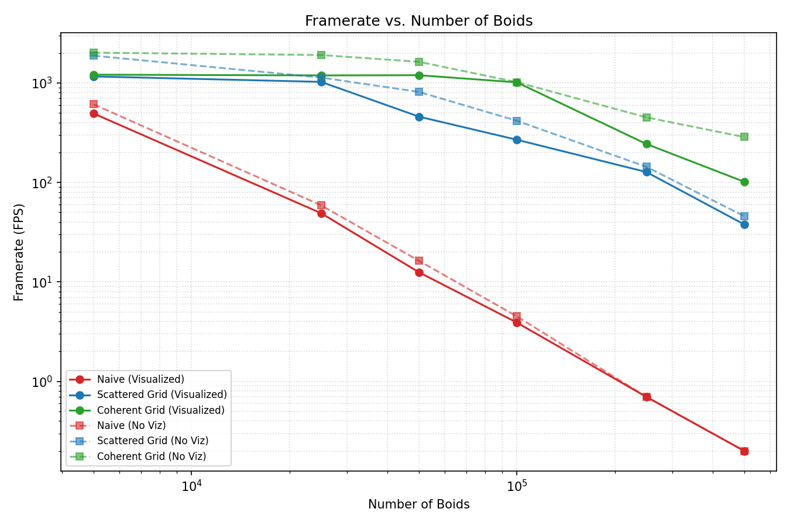
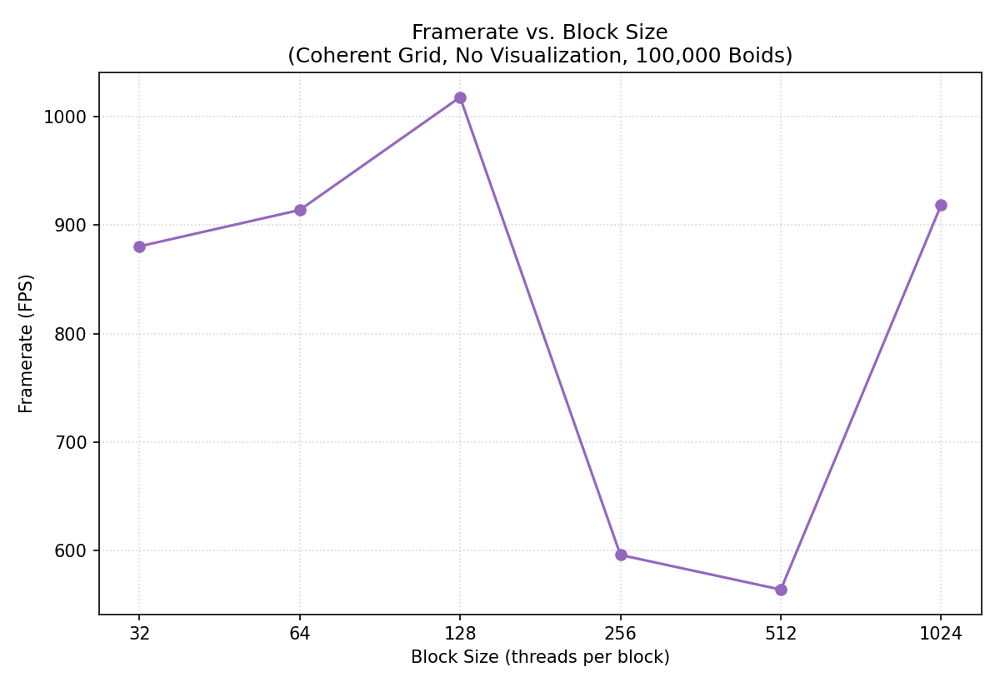

**University of Pennsylvania, CIS 5650: GPU Programming and Architecture,
Project 1 - Flocking**

* Nico Kong
   [LinkedIn](https://www.linkedin.com/in/nicola-kong/), [Email]: nebfinn@gmail.com
* Tested on: Windows 11, AMD Ryzen AI 9 HX 370 @ 2.0GHz 32GB, RTX 4060 8GB (Personal Laptop)

## Showcase

Results are captured with Scattered Uniform Grid, 50000 Boids and 128 Block Size.

 

## Performance Analysis

For the values listed in the following tables and graphs, I calculated the average fps of the simulation and waited for it to stabilize to record the value.

### Framerate change with increasing # of boids

Block Size: 128

**With Visualization**

| # Boids | Naive (fps) | Scattered Uniform Grid (fps) | Coherent Uniform Grid (fps) |
|---|---|---|---|
| 5,000    | 492.5 | 1160.8 | 1210.1 |
| 25,000   | 49.1 | 1024.4 | 1189.2 |
| 50,000   | 12.5 | 458.1 | 1194.8 |
| 100,000  | 3.9 | 268.3 | 1013.0 |
| 250,000  | 0.7 | 127.2 | 243.3 |
| 500,000  | 0.2 | 37.8 | 101.4 |

**Without Visualization**

| # Boids | Naive (fps) | Scattered Uniform Grid (fps) | Coherent Uniform Grid (fps) |
|---|---|---|---|
| 5,000    | 609.2 | 1878.9 | 2014.2 |
| 25,000   | 58.9 | 1132.5 | 1905.4 |
| 50,000   | 16.3 | 812.0 | 1630.3 |
| 100,000  | 4.5 | 416.2 | 1317.9 |
| 250,000  | 0.7 | 143.4 | 450.7 |
| 500,000  | 0.2 | 45.7 | 285.8 |

### Framerate change with increasing block size

Method: WithVisualization, Coherent Uniform Grid, 100000 Boids

| Block Size | Framerate (fps) |
|---|---|
| 32   | 880.5 |
| 64   | 914.0 |
| 128  | 1013.0 |
| 256  | 596.2 |
| 512  | 564.3 |
| 1024 | 918.7 |

### Discussion Questions

**For each implementation, how does changing the number of boids affect performance? Why do you think this is?**

Increasing the number of boids consistently makes the simulation run slower and gets a slower fps. This is rather straight forward as more boids means more cycles to process through all the boids, especially if the number of boids is greater than the maximum amount of processes running in parallel at once.

**For each implementation, how does changing the block count and block size affect performance? Why do you think this is?**

Out of all the block sizes I've tested, 128 had the best performance and both increasing and decreasing it from there makes the performance worse again. unexpectedly, 1024 as a block size consistently had a massive performance spike over multiple attempts and I will look into possible explanations.

**For the coherent uniform grid: did you experience any performance improvements with the more coherent uniform grid? Was this the outcome you expected? Why or why not?**

Coherent uniform grid was a massive performance improvement across every scenario I tested. This matches my expectation as better memory locality for nearby cells will likely result in better performance due to a better cache efficiency.

**Did changing cell width and checking 27 vs 8 neighboring cells affect performance? Why or why not?**

Surprisingly, the 27 cell version consistently ran faster. I suspect that the reason of this is while the loop runs over more cells, the average cell contains less boids and looping over boids takes more time that looping over cells.

